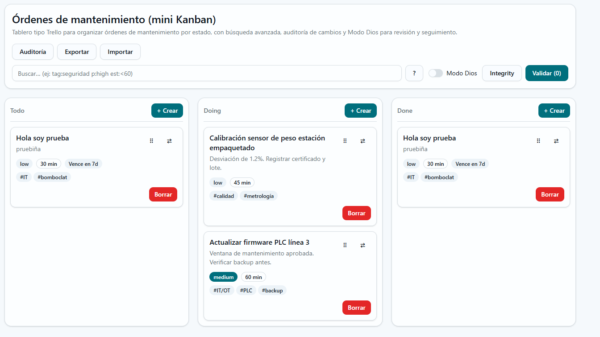
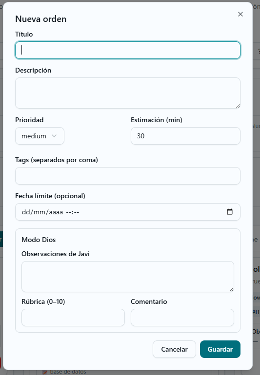
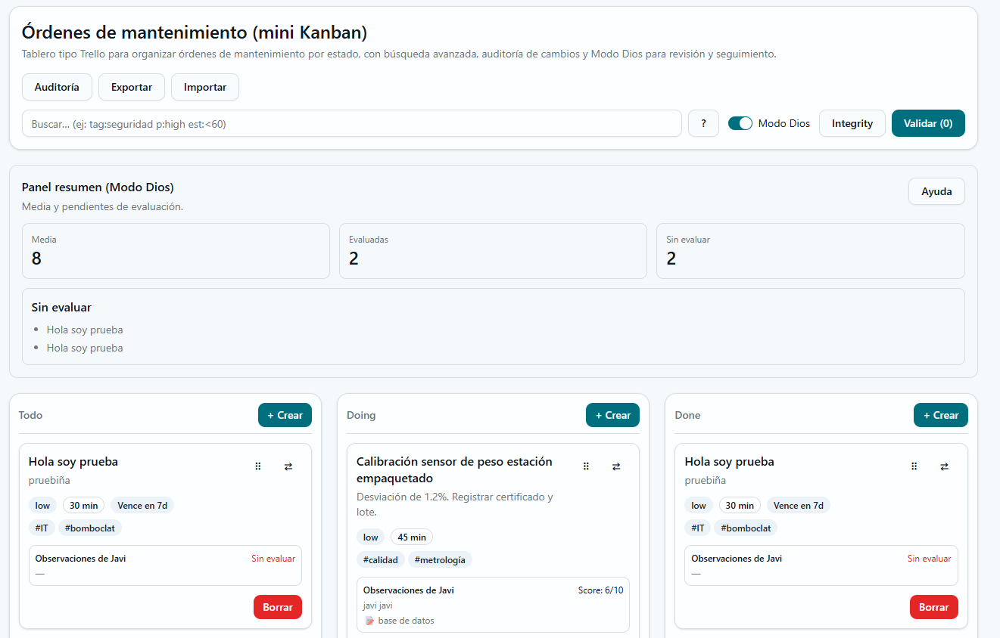

# Mini Kanban (Trello de Mantenimiento)

## Objetivo
Tablero tipo Trello para organizar órdenes de mantenimiento por estado, con búsqueda avanzada, auditoría de cambios y Modo Dios para revisión y seguimiento.

## Cómo se usa en la app
1. Crea una orden con **+ Crear** en la columna correspondiente.
2. Arrastra las tarjetas entre columnas para cambiar su estado.
3. Usa la barra de búsqueda para filtrar por texto, tags, prioridad, vencimientos y estimación.
4. Activa **Modo Dios** para añadir observaciones y rúbrica (0–10) a cada tarea.

## Capturas

## Vercel
Vercel: `PEGAR_AQUI_TU_ENLACE`
